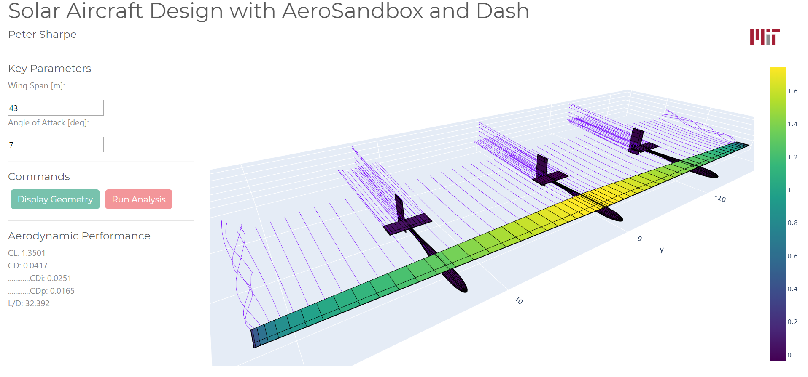

# AeroSandbox-Interactive-Demo
by Peter Sharpe

## Description
An interactive demo of AeroSandbox, powered by Dash! Work in progress.

## Installation and Usage
1. Install all dependencies listed in `requirements.txt` in accordance with the versions specified. All packages are pip-installable (e.g. `pip install aerosandbox`).
2. Run `demo.py` to launch a local Dash server to host the Dash app. A link will appear in your console; click this to use the Dash app.

## Illustration
